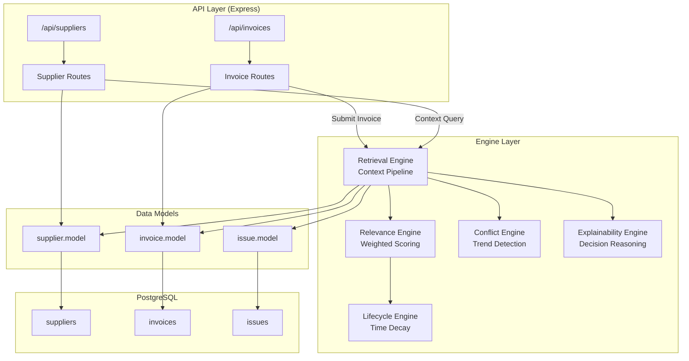
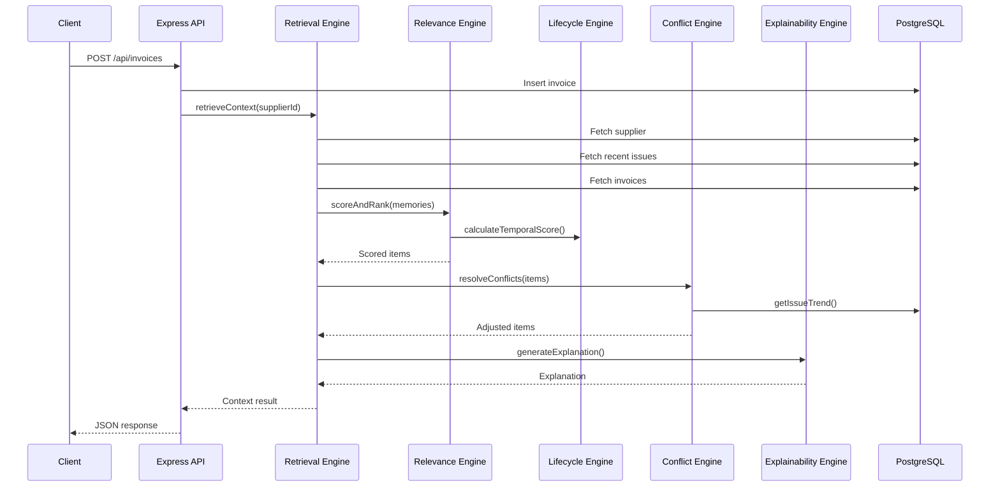
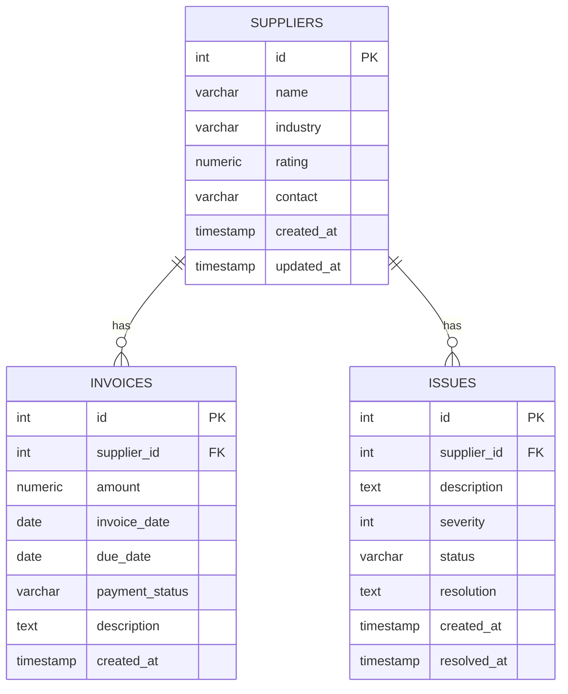

# Architecture — Business Context Memory Engine

This document provides the technical architecture details, data flow diagrams, scoring mathematics, and design rationale for the Business Context Memory Engine.

## System Architecture Diagram



## Data Flow



## Memory Hierarchy

```
┌─────────────────────────────────────────────┐
│              Active Memory Pool              │
│                                              │
│  ┌──────────┐  ┌──────────┐  ┌──────────┐  │
│  │ Suppliers │  │ Invoices │  │  Issues  │  │
│  │  (rated)  │  │ (tracked)│  │(severity)│  │
│  └────┬─────┘  └────┬─────┘  └────┬─────┘  │
│       │              │              │        │
│       └──────── FK ──┴──── FK ──────┘        │
│                                              │
├──────────────────────────────────────────────┤
│           Temporal Decay Layer               │
│  Score = e^(-0.01 × daysOld) × ageWeight    │
│  <6mo: 1.0 | 6-24mo: 0.5 | >24mo: 0.0     │
├──────────────────────────────────────────────┤
│           Relevance Scoring                  │
│  Final = 0.4T + 0.3R + 0.3S                │
├──────────────────────────────────────────────┤
│           Conflict Resolution                │
│  Worsening: ×1.3 | Improving: ×0.7         │
├──────────────────────────────────────────────┤
│           Archive (>2 years)                 │
└──────────────────────────────────────────────┘
```

## Retrieval Pipeline Detail

The retrieval engine follows a 5-step pipeline:

### Step 1: Candidate Gathering
```sql
-- Fetch supplier issues (look-back window)
SELECT * FROM issues
WHERE supplier_id = $1
  AND created_at >= CURRENT_TIMESTAMP - INTERVAL '120 days'
ORDER BY created_at DESC;

-- Fetch supplier invoices
SELECT * FROM invoices
WHERE supplier_id = $1
ORDER BY created_at DESC;
```

### Step 2: Scoring

For each memory M:
```
temporal   = e^(-0.01 × age_in_days)
relational = 1.0 if same supplier, 0.6 if same industry, 0.2 otherwise
semantic   = keyword_hits / total_keywords
finalScore = 0.4 × temporal + 0.3 × relational + 0.3 × semantic
```

### Step 3: Conflict Resolution

```
recentAvgSeverity = avg(last 3 issues severity)
olderAvgSeverity  = avg(older issues severity)

if recentAvg > olderAvg + 0.3 → "worsening" → multiply scores × 1.3
if recentAvg < olderAvg - 0.3 → "improving" → multiply scores × 0.7
else                          → "stable"    → no adjustment
```

### Step 4: Ranking

Sort all scored memories by `finalScore` descending. Return top 5.

### Step 5: Explanation

Generate structured JSON with:
- Flag decision (FLAGGED / CLEAR)
- Human-readable narrative
- Per-item scoring breakdown
- Trend analysis summary

## Database Schema



## Performance Indexes

| Index | Table | Column(s) | Purpose |
|-------|-------|-----------|---------|
| `idx_suppliers_industry` | suppliers | industry | Industry filtering |
| `idx_invoices_supplier_id` | invoices | supplier_id | Supplier lookups |
| `idx_invoices_due_date` | invoices | due_date | Overdue detection |
| `idx_invoices_payment_status` | invoices | payment_status | Status filtering |
| `idx_invoices_created_at` | invoices | created_at | Temporal queries |
| `idx_issues_supplier_id` | issues | supplier_id | Supplier lookups |
| `idx_issues_created_at` | issues | created_at | Temporal queries |
| `idx_issues_severity` | issues | severity | Severity filtering |
| `idx_issues_status` | issues | status | Status filtering |
| `idx_issues_supplier_created` | issues | (supplier_id, created_at) | Composite — most used query |

## Design Decisions

| Decision | Rationale |
|----------|-----------|
| PostgreSQL over NoSQL | Relational data with strong FK constraints needed for entity linking |
| Express.js | Lightweight, industry-standard REST framework |
| No ORM (raw SQL) | Full control over queries, easier to optimize and index |
| Exponential decay | Natural decay curve — recent data stays relevant longest |
| Three-score composite | Balances recency, relationships, and content relevance |
| Keyword matching over LLM | Lightweight, deterministic, no API costs |
